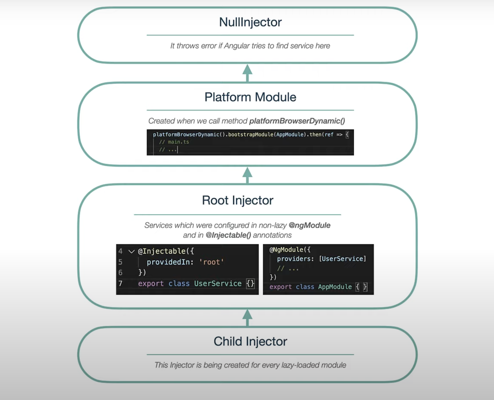
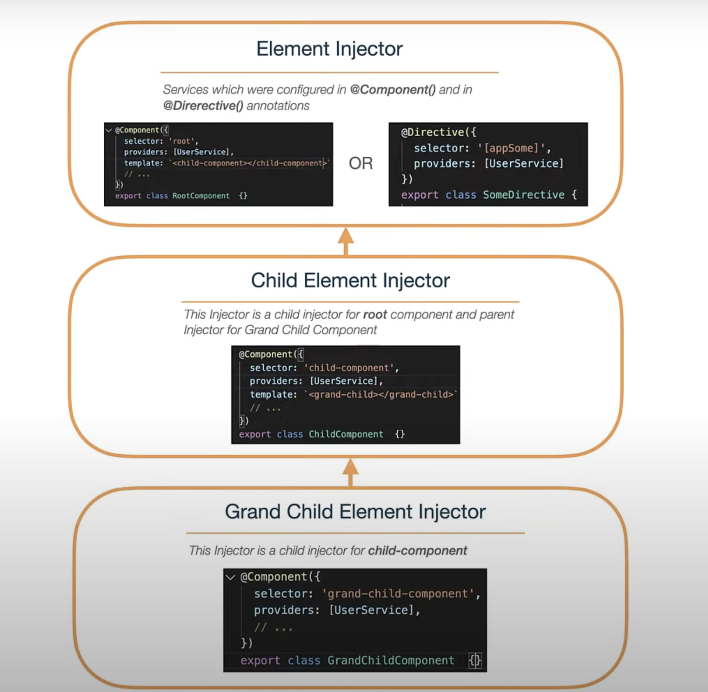
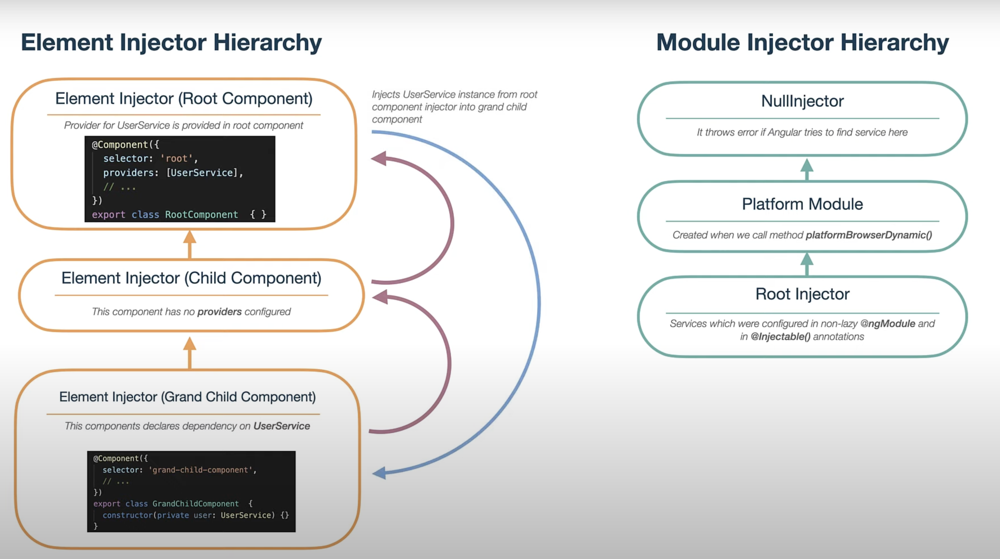
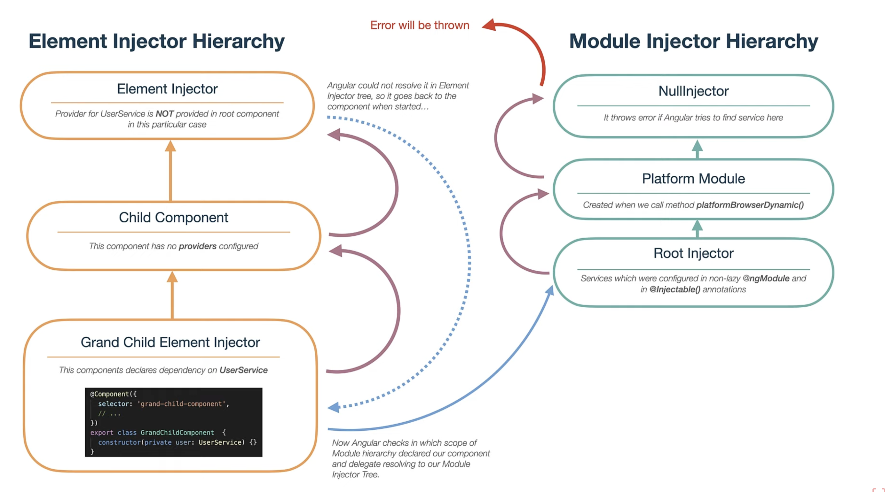

# Angular Dependency Injection

**Classic Defination**:
DI is a coding pattern in which classes asks for dependencies from external sources rather than creating themselves.

**Why do we need this dependency injection?**:
The main reason we need this dependency injection is to avoid hard depencencies between classes and decoupling of object creation from using this object enables you to replace dependencies without changing the class which is using them.

```typescript
@Component({
  selector: 'app-root',
  templateUrl: './app.component.html',
  styleUrls: ['./app.component.scss']
})
export class AppComponent {
  constructor(private userService: UserService);
}
```

In the above example, the AppComponent delegates the creation of UserService to **Injector** which is responsible for creation of class instance and inject into the constructor of the object.

## **Hierachieal Dependency Injection:**

Angular has not only one injector, but but it creates a hierarchy of injectors.

We Mainly have 2 types of Injectors. One is Module Injector and the other is Element Injector.

### Module Injector:

1. **Null Injector**: At the very top there is a null injector the responsibility of this injector is very easy it just throws the error if something tries to find dependencies there.

2. **Platform Injector**: During application bootstrapping, Angular creates few more injectors. Above the root injector, there goes platform injector this one is being created by platformBrowserDynamic() function inside **_main.ts_** file and it provides some platform specific features like dom-sanitizer, platform-id, token and so on.

3. **Root Injector**: when angular starts it creates a root injector where we'll be registered our services which we provided via @Injectable annotation.

- All services provided in ngModule property called providers if those modules are **not lazy loaded** angular recursively goes through all modules which are being used in the application and creates instances for provided services in root injector.

- So, if you thought that if you provide some service in some module and it will be available only in scope of this module, it is actually wrong if you provide some service in **eagerly loaded model** it will be added to the **root injector** which makes it available across whole application

4. **Child Injector**:
   Modules which were loaded lazily create its own injector which are children for our root injector.

- The child injectors for it we know that another modules which we import in our root or app module they are not creating new child injectors and providers from them go to the root-injector but it is valid only for non-lazy models.



### Element Injector:

Element injector is being created for any tag that matches angular component or any tag on which directive is applied and you can configure it in component and directive annotations inside provider's property and it creates its own hierarchy likewise component one.



## How Angular resolves dependencies?





Reference:
https://youtu.be/uVGnsmm9g-I
